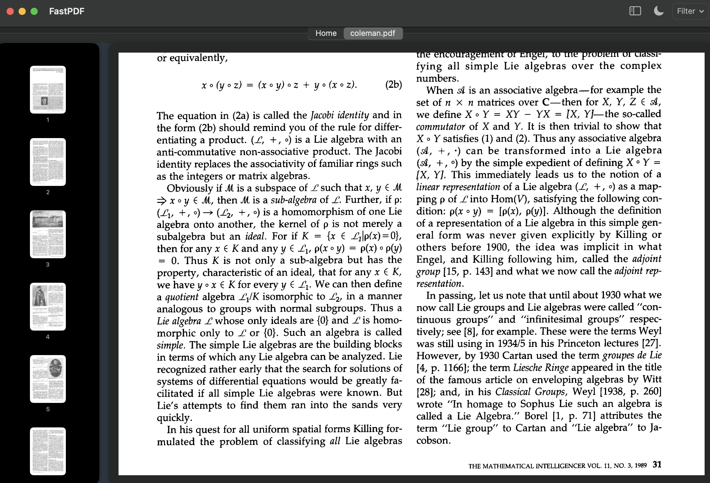

# FastPDF

FastPDF is a lightweight, fast, and minimal PDF viewer for macOS built using Swift and SwiftUI. It offers a clean interface with support for recent file tracking, drag-and-drop, and keyboard shortcuts.



## Features

- Open and view PDF files instantly
- Drag-and-drop support for PDF files
- List of recently opened documents
- Manual file picker and quick reload
- macOS-style interface with native performance

## Tech Stack

- **Language:** Swift
- **UI Framework:** SwiftUI
- **PDF Rendering:** PDFKit
- **Platform:** macOS

## Requirements

- macOS 12.0 or later
- Xcode 13 or later
- Swift 5.5+

## Running the Project

1. Clone the repository:
   ```bash
   git clone https://github.com/sumirr/fastpdf.git
   cd fastpdf
